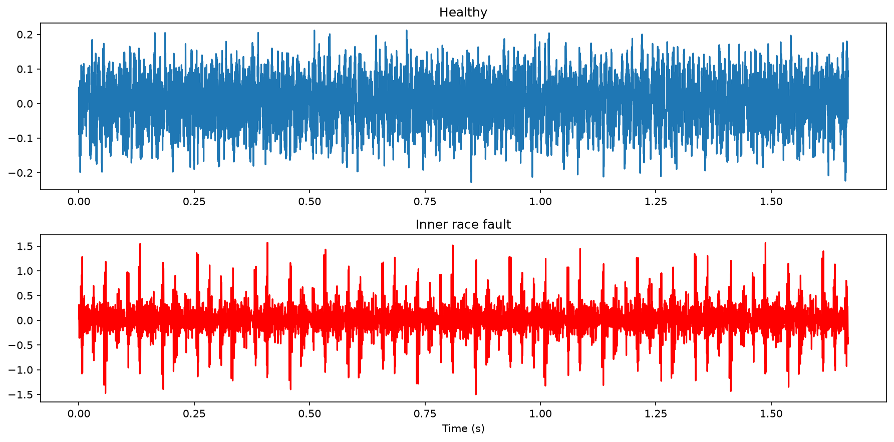
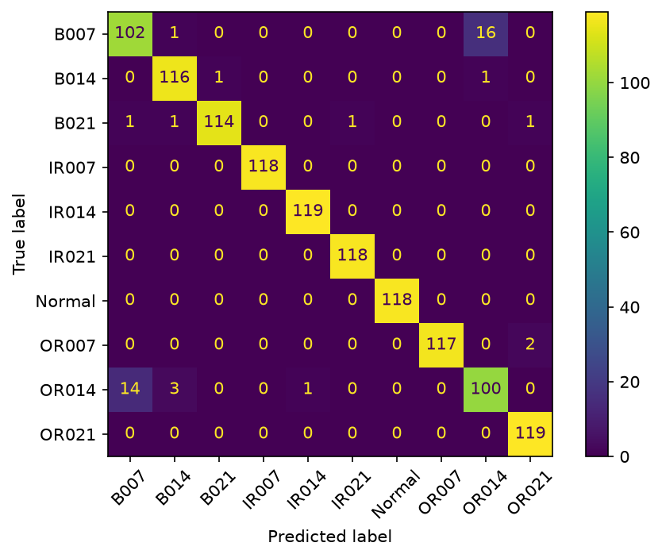

# Bearing Fault Detection from Vibration Signals

I trained a model to tell whether a motor bearing is healthy or damaged just
by looking at its vibration data. Built on the CWRU bearing dataset, which is
pretty much the standard benchmark for this kind of thing.

The dataset has recordings from a healthy bearing and from bearings with
seeded faults (cracks on the inner race, outer race, or the ball itself, at
three different sizes). That gives 10 classes total.

## How it works

The core observation: a damaged bearing makes a sharp little impact every
time the ball rolls over the defect. You can't really see this in the raw
waveform stats, but in the frequency domain it's obvious — the impacts excite
the bearing's resonant frequencies and a whole region of the spectrum lights up:



So the pipeline is:

1. Load the raw accelerometer signals (sampled at 12 kHz, from .mat files)
2. Chop each recording into overlapping windows of 2048 samples — this turns
   10 long recordings into a few thousand training examples
3. For each window, compute a handful of features instead of using the raw
   samples: RMS, kurtosis, crest factor, spectral centroid, and the energy
   in four frequency bands (FFT-based)
4. Train a Random Forest on those features

Kurtosis and the mid-frequency band energies end up doing most of the work,
which matches the physics — impacts make the signal spiky and dump energy
into the resonance region.

## Results

[96.3]% accuracy on a held-out test set (25%, stratified, 10 classes).



One caveat I'm aware of: the windows overlap and every class comes from a
single recording, so some information leaks between train and test — the
real-world number would be lower. The proper way to test this is to train
on one motor load and evaluate on a different one (the dataset has
recordings at 0–3 HP). That's the next thing I want to do.

## Running it

```bash
git clone https://github.com/yashhorseman/bearing-fault-detection.git
cd bearing-fault-detection
python3 -m venv venv && source venv/bin/activate
pip install -r requirements.txt
```

The data isn't in the repo (files are big). Grab it from the
[CWRU Bearing Data Center](https://engineering.case.edu/bearingdatacenter)
and drop the .mat files into `data/raw/`.
