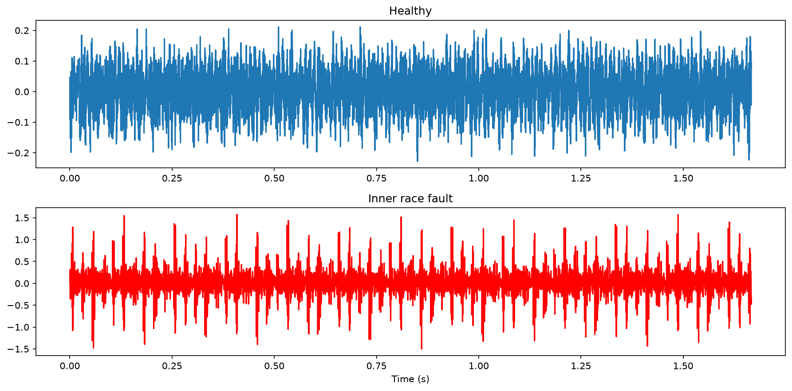
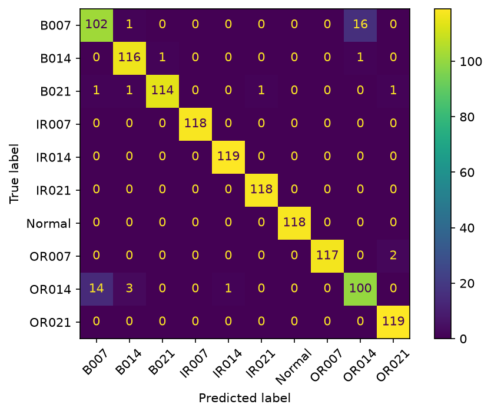

# Bearing Fault Detection from Vibration Signals

I trained a model to tell whether a motor bearing is healthy or damaged just
by looking at its vibration data. Built on the CWRU bearing dataset, which is
pretty much the standard benchmark for this kind of thing.

The dataset has recordings from a healthy bearing and from bearings with
seeded faults (cracks on the inner race, outer race, or the ball itself, at
three different sizes). That gives 10 classes total.

## How it works

The core observation: a damaged bearing makes a sharp little impact every
time the ball rolls over the defect. You can't really see this in the raw
waveform stats, but in the frequency domain it's obvious — the impacts excite
the bearing's resonant frequencies and a whole region of the spectrum lights up:



So the pipeline is:

1. Load the raw accelerometer signals (sampled at 12 kHz, from .mat files)
2. Chop each recording into overlapping windows of 2048 samples — this turns
   10 long recordings into a few thousand training examples
3. For each window, compute a handful of features instead of using the raw
   samples: RMS, kurtosis, crest factor, spectral centroid, and the energy
   in four frequency bands (FFT-based)
4. Train a Random Forest on those features

Kurtosis and the mid-frequency band energies end up doing most of the work,
which matches the physics — impacts make the signal spiky and dump energy
into the resonance region.

## Results

[96.3]% accuracy on a held-out test set (25%, stratified, 10 classes).



One caveat I'm aware of: the windows overlap and every class comes from a
single recording, so some information leaks between train and test — the
real-world number would be lower. The proper way to test this is to train
on one sensor position and evaluate on one the model has never seen. So I
went and did that.

## Does it actually generalize?

CWRU has two accelerometers per recording, drive-end and fan-end. I trained
on drive-end and tested on fan-end from the same runs. Accuracy fell off a
cliff — down to about 18%. Turned out CWRU only has fault recordings for the
drive-end sensor to begin with, so the comparison wasn't as clean as I
wanted, but it was enough of a warning sign to go find a dataset actually
built for this kind of test.

## Moving to MaFaulDa

MaFaulDa is a bigger dataset recorded off a real motor test rig — normal
runs plus three fault types (ball, cage, outer race), each recorded from two
different bearing housings on the same shaft, underhang and overhang, at a
few different imbalance loads. Good setup for testing whether a model
trained at one mounting point works at another.

Same pipeline, random split: 96.5%, basically matching CWRU. Then the real
test — train on underhang, test on overhang — and it dropped to 32%.
Normalizing each window by its own RMS before extracting features made it
*worse* (17.5%), which ruled out a simple volume/scale explanation.

## Why it falls apart

I trained a separate classifier to guess which sensor a window came from,
using the exact same features, and it got that right basically 100% of the
time — even on windows with no fault at all. So the features aren't just
picking up the fault, they're picking up which bearing housing they were
recorded from. Underhang and overhang turn out to differ hugely in raw
amplitude (about 12x on a healthy bearing) and in where their energy sits in
the spectrum — overhang's is almost entirely in the lowest frequency band,
underhang splits its energy between that same low band and a second one way
up around 20-25kHz. Two physically different sensors on the rig, not a
subtle statistical quirk.

I tried a handful of ways to correct for this: standardizing each location
against its own mean/std, an alignment technique called CORAL that reshapes
one location's feature covariance to look like the other's, log-compressing
the features before aligning them. Best I got was about 52% accuracy.
Swapping the hand-picked features for a CNN trained directly on the raw
waveform did worse, not better (30%) — it just memorized underhang's
specific quirks even harder, having way more capacity to overfit with
nothing forcing it not to. I also tried domain-adversarial training, which
explicitly penalizes the network for being able to tell the two locations
apart — got it to genuinely stop leaking location info, confirmed by
checking that a location-classifier on its learned features was stuck at
chance. Didn't move the needle on the thing I actually cared about.

And the thing I actually cared about was `normal`. Across every single one
of those attempts, recall on the healthy class sat at exactly zero. Not
low — zero. Even splitting the problem into two stages, a first model that
just catches the loud obvious fault and a second one for everything else,
didn't help: the first stage worked great on its own (95%), but healthy
bearings still never got recognized once they made it to the second model,
and the two-stage setup ended up slightly worse overall than one flat
classifier anyway.

So where I've landed: whatever makes a bearing sound "healthy" doesn't
leave much of a trace that survives moving from one sensor mount to
another. The loud fault is the one thing that reliably transfers. I'm
treating that as a real result rather than something to keep throwing
bigger models at — next step is probably either scoping this down to
"obvious fault vs. not" as the realistic target, or accepting that a new
sensor mount needs at least a few labeled healthy examples before you can
trust the model on it, since a fully blind transfer doesn't look
achievable with any of this.

## Running it

```bash
git clone https://github.com/yashhorseman/bearing-fault-detection.git
cd bearing-fault-detection
python3 -m venv venv && source venv/bin/activate
pip install -r requirements.txt
```

The data isn't in the repo (files are big). Grab it from the
[CWRU Bearing Data Center](https://engineering.case.edu/bearingdatacenter)
and drop the .mat files into `data/raw/`.

For the MaFaulDa side, download their normal/underhang/overhang folders and
drop them into `data/raw/mafaulda/` keeping the same folder structure they
come in.
